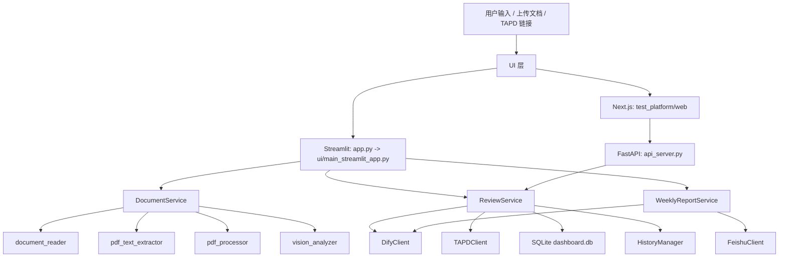

# 测试平台技术文档

## 1. 文档说明

- 文档目的：对当前仓库中的测试平台项目进行一次基于代码现状的技术盘点，沉淀系统架构、模块职责、运行方式、依赖关系与当前风险。
- 检查日期：2026-03-18
- 最近增量更新时间：2026-03-23
- 检查范围：`/Users/linkb/PycharmProjects/my_app/test_platform`
- 说明：本文档以代码实现为准，重点覆盖测试平台主工程，不包含旁路项目 `ai_news_bot` 的详细设计。

## 2. 项目概述

当前测试平台是一个面向测试与需求分析场景的 AI 工作台，核心目标是将需求评审、测试点提取、测试用例生成、测试用例评审、测试方案编写、流程图梳理、日志诊断、自动化脚本生成和周报输出等能力集中到同一平台中。

从代码形态看，项目当前已经形成“主链路收口、双 UI 并存”的状态：

- Streamlit 路径仍然是功能最完整的交付版本。
- Next.js + FastAPI 路径已经具备稳定的工程骨架、构建链路和前端原生测试能力。
- 旧入口与旧适配器已大多回流为兼容壳，不再承担独立业务实现。

## 3. 核心能力清单

平台当前已实现或设计中的能力包括：

- 智能需求评审
- 需求结构化分析
- 测试点提取
- 测试用例生成
- 测试用例评审
- 测试方案生成
- 测试数据构造
- 影响面分析
- 业务流程图生成
- 日志诊断
- 接口测试脚本生成
- 性能压测脚本生成
- UI 自动化脚本生成
- 周报总结与飞书发布
- TAPD 需求读取与缺陷创建

## 4. 总体架构



### 4.1 架构分层

- UI 层
  - `test_platform/app.py`：Streamlit 主入口兼容壳。
  - `test_platform/ui/main_streamlit_app.py`：当前真实的 Streamlit UI 实现。
  - `test_platform/ui/streamlit_app.py`：旧 Streamlit 入口兼容壳。
  - `test_platform/web/`：Next.js Web 工作台。
- 接口层
  - `test_platform/api_server.py`：为 Next.js 提供 FastAPI API。
- 服务层
  - `test_platform/core/services/review_service.py`：平台主编排核心。
  - `test_platform/core/services/document_service.py`：文档处理编排入口。
  - `test_platform/core/services/weekly_report_service.py`：周报总结与飞书发布。
- 基础设施层
  - `test_platform/services/dify_client.py`
  - `test_platform/infrastructure/tapd_client.py`
  - `test_platform/infrastructure/feishu_client.py`
- 存储层
  - SQLite：`test_platform/core/db/dashboard.db`
  - 本地历史记录：仓库根目录 `history/`

## 5. 目录结构

```text
test_platform/
├── app.py                          # Streamlit 主入口兼容壳
├── api_server.py                   # FastAPI 接口服务
├── config.py                       # 环境变量与平台配置
├── config/roles.json               # 多角色评审配置
├── core/
│   ├── services/                   # Review / Document / WeeklyReport 核心服务
│   ├── document_processing/        # PDF、表格、视觉识别处理链路
│   ├── data_generators/            # 测试用例导出器
│   └── db/                         # SQLite 仪表盘数据库
├── infrastructure/                 # TAPD、飞书等基础设施适配
├── services/                       # 旧版公共服务与重复适配器
├── ui/                             # Streamlit UI 与兼容入口
├── utils/                          # JSON 解析、历史记录等工具
├── web/                            # Next.js 前端工作台
└── docs/                           # 项目文档
```

## 6. 技术栈

### 6.1 Python 侧

- Python
- Streamlit
- FastAPI
- Uvicorn
- Pydantic
- Requests
- pdfplumber
- PyMuPDF
- pdf2image
- python-dotenv
- openpyxl
- XlsxWriter
- xmind

### 6.2 Web 侧

- Next.js 16.1.6
- React 19.2.3
- TypeScript 5
- Zustand 5
- Tailwind CSS 4
- `@tanstack/react-table`
- `react-markdown`
- `react-hotkeys-hook`

### 6.3 外部依赖

- Dify：作为核心大模型编排与多模态入口
- TAPD：读取需求、创建缺陷
- 飞书：周报文档发布
- SQLite：本地运行记录统计

## 7. 核心模块设计

### 7.1 ReviewService

`test_platform/core/services/review_service.py` 是平台最核心的业务编排模块，主要职责包括：

- 加载技能提示词
- 根据需求内容推荐专家角色
- 解析输入需求或文档
- 对 PDF 文档进行模块识别
- 按模块并发执行 AI 分析
- 基于 token 预算裁剪超长上下文
- 支持多角色评审与架构师仲裁
- 生成测试用例、测试点、需求分析、流程图、测试方案等结果
- 评审已有测试用例并生成修订建议版测试用例
- 提取结构化风险项
- 将执行记录写入 SQLite

当前支持的模式在 `test_platform/core/skill_modes.py` 中统一定义，包含：

- `review`
- `test_case`
- `test_case_review`
- `req_analysis`
- `test_point`
- `log_diagnosis`
- `test_data`
- `impact_analysis`
- `test_plan`
- `flowchart`
- `api_test_gen`
- `api_perf_test_gen`
- `auto_script_gen`

#### 7.1.1 测试用例生成链路更新

2026-03-22 起，`test_case` 模式已经从“全文一次性生成”收敛为更稳的分阶段链路：

1. 先按模块提取需求正文与图片上下文。
2. 逐模块生成结构化测试用例。
3. 基于模块结果构建“已有覆盖摘要”。
4. 再生成跨模块与全局规则补漏用例。
5. 合并并去重后，统一序列化为 Case Suite。

当前模块级测试用例的结构化契约已经固定为：

```json
{
  "priority": "P0/P1/P2/P3",
  "module": "模块名",
  "title": "用例标题",
  "precondition": "前置条件",
  "steps": [
    {
      "action": "步骤动作",
      "expected": "该步骤对应的预期结果"
    }
  ]
}
```

这条链路的关键设计点如下：

- 模块级生成与全局补漏分两次请求，避免一次性塞满上下文窗口。
- 全局补漏只关注跨模块流程、全局规则、角色权限、状态流转、异常逆向、边界条件、幂等与并发。
- 去重时保留模块边界，不会因为跨模块同名用例而误删模块内场景。
- 外部输出契约中的 `items` 与 Markdown 已移除 `tags`、`remark` 字段，避免无效冗余信息继续向前传递。
- 导出层仍保留空字符串形式的 `tags`、`remark` 字段，用于兼容现有 Excel / XMind 导出模板。

#### 7.1.2 测试用例评审链路更新

2026-03-23 起，平台新增 `test_case_review` 模式，用于承接“已有测试用例 + 原始需求上下文”的结构化评审链路。

当前实现已经固定为以下五段式流程：

1. 先准备需求上下文。
   - 支持直接输入需求、上传需求文档、读取 TAPD、复用最近一次 `context_id`
   - 没有需求上下文时，不允许外部导入测试用例进入正式评审
2. 再统一解析测试用例来源。
   - 支持平台内 `test_case` 结果直接送审
   - 支持文本 / Markdown / JSON 粘贴
   - 支持 Excel、XMind 文件导入
3. 所有输入先归一为统一的 `TestCaseSuite`。
   - 解析逻辑集中在 `test_platform/core/services/test_case_review_service.py`
   - 当前首版优先兼容平台导出结构和常见测试用例模板
4. 评审结果统一落为结构化 payload。
   - `summary`
   - `findings`
   - `reviewed_cases`
   - `revised_suite`
   - `markdown`
5. 结果侧同时支持页面展示、Markdown 导出和历史沉淀。
   - 历史类型使用 `test_case_review`
   - 修订建议版测试用例继续复用现有测试用例表格与导出链路

这条链路的关键设计点如下：

- 评审过程必须始终绑定原始需求，避免脱离需求做纯格式检查。
- 评审结果不只给问题清单，还会返回逐条结论和修订建议版测试用例。
- 测试用例页已经补齐“送审”入口，可将当前结果直接写入评审模块会话。
- 前端独立页面 `TestCaseReviewPage` 与后端 `test_case_review` 模式一一对应。

#### 7.1.3 上下文窗口与吞吐保护

为降低 GPT-5.x 模型在长需求文档场景下的超时、限流和慢响应问题，`ReviewService` 与 `DifyClient` 已补充以下保护策略：

- `ReviewService` 使用 `tiktoken` 进行 token 级预算裁剪，优先控制单次 prompt 的输入规模。
- 默认 tokenizer 编码为 `o200k_base`，不可用时退回本地近似分词。
- 默认最大 prompt 输入预算为 `60000` tokens，而不是直接把全部上下文塞入模型。
- 单角色与多角色并发默认都限制为 `1`，避免放大 Azure OpenAI Provisioned-Managed 吞吐压力。
- `DifyClient` 对限流错误使用“更长的指数退避 + 冷却时间”重试策略，并通过环境变量控制重试次数与等待时长。
- API 层会识别并透传 `DifyRateLimitError`，向前端返回更明确的吞吐受限提示。

### 7.2 文档处理链路

`DocumentService` 负责统一文档入口，内部依赖：

- `document_reader.py`
  - 支持 PDF、DOCX、DOC、XLSX、TXT、MD、HTML、CSV、JSON、YAML、XML 等格式。
- `pdf_text_extractor.py`
  - 对 PDF 页面做文本提取、图像占比、文本密度、乱码风险、流程图特征等评分。
  - 决定页面是否需要走视觉补偿链路。
- `pdf_processor.py`
  - 将 PDF 页面转为图片并缓存为 Base64。
- `vision_analyzer.py`
  - 定义视觉适配接口。
  - 当前实现有 `DifyVisionAnalyzer` 与 `MockVisionAnalyzer`。

该链路的设计特点是：

- 对非 PDF 直接提纯文本。
- 对 PDF 走“文本提取 + 视觉补偿”的混合策略。
- 对需要视觉分析的页面并发上传到 Dify。
- 对文档页级元数据做状态记录，便于后续模块拆分和问题定位。

### 7.3 周报服务

`WeeklyReportService` 用于处理企业微信讨论文本与截图，生成 Markdown 周报，并通过 `FeishuClient` 写入飞书文档。

能力链路如下：

1. 汇总输入文本与截图。
2. 调用 Dify 做清洗与总结。
3. 将 Markdown 解析成飞书块结构。
4. 创建飞书文档、写入内容、设置权限。
5. 返回飞书文档链接。

目前这条链路主要在 Streamlit 主应用中可用。

### 7.4 TAPD 集成

`TAPDClient` 目前提供以下能力：

- 从 TAPD 链接中解析 `story_id`
- 获取需求详情
- 创建缺陷
- 将 UI 优先级、严重程度映射为 TAPD 字段

### 7.5 持久化与可观测性

项目存在两类轻量持久化：

- SQLite：`dashboard.db`
  - 记录动作类型、目标对象、执行状态、耗时、错误信息。
  - 为前端仪表盘提供统计数据。
- 本地 JSON 历史记录：
  - 通过 `HistoryManager` 保存在根目录 `history/`
  - 保存评审报告、测试用例、测试用例评审报告、周报等生成结果

## 8. 前后端协作关系

### 8.1 Streamlit 路径

当前 Streamlit 路径由两层组成：

- `test_platform/app.py`
  - 仅作为兼容入口存在。
- `test_platform/ui/main_streamlit_app.py`
  - 承担真实的 Streamlit 页面逻辑。

当前真实的 Streamlit UI 负责：

- 页面交互
- 文档上传
- 周报生成
- 文档处理编排
- AI 执行过程状态展示
- 历史记录读写

### 8.2 FastAPI 路径

`test_platform/api_server.py` 当前提供的接口较精简：

- `GET /health`
- `POST /recommend-experts`
- `POST /run`
- `POST /run/stream`
- `GET /api/dashboard/stats`
- `GET /api/history/reports`
- `GET /api/history/reports/{report_id}`
- `GET /api/history/reports/{report_id}/artifacts/{artifact_key}`
- `GET /api/tapd/story`
- `POST /api/test-cases/export`

该层主要为 Next.js Web 提供桥接，当前已经覆盖运行、流式进度、历史记录、TAPD 读取和测试用例导出等核心工作台接口。

### 8.3 Next.js 路径

`test_platform/web/` 当前实现了：

- 仪表盘
- 需求评审页
- 测试用例页
- 测试用例评审页
- 通用模块页
- UI 自动化页
- Sidebar / Command Palette / Insight Panel / 快捷键体系

状态管理使用 Zustand 的 slice 模式，API 通过 `src/lib/api.ts` 调用本地 `http://localhost:8000`。

## 9. 主要运行方式

### 9.1 Streamlit 单体模式

可通过以下路径启动：

- `python -m streamlit run test_platform/app.py`
- `bash start_web_ui.sh`
- `make ui`
- `source test_platform/.venv/bin/activate && python3 -m streamlit run test_platform/app.py`

注意：

- `cli.py`、`start_web_ui.sh` 默认统一读取环境变量 `TEST_PLATFORM_STREAMLIT_PORT`，未配置时默认使用 `8501`
- Docker 与 `start_web_ui.sh` 当前都通过 `test_platform/app.py` 兼容入口启动 Streamlit 主应用
- 推荐优先使用 `test_platform/.venv` 作为本地开发虚拟环境
- 更详细的本地使用说明见 `test_platform/docs/本地开发指南.md`

### 9.2 Web 工作台模式

`start.sh` 会执行两件事：

1. 启动 FastAPI：端口 `8000`
2. 启动 Next.js：端口 `3000`

该模式已经覆盖需求评审、测试用例生成、测试用例评审、历史沉淀等核心工作台链路，但 Docker 交付和 Streamlit 路径仍未完全统一。

### 9.3 Docker 模式

当前根目录 `docker-compose.yml` 与 `test_platform/Dockerfile` 只覆盖 Streamlit 部署链路：

- 暴露端口：`8501`
- 容器内默认命令：`streamlit run app.py`

这意味着 Docker 方案目前没有把 FastAPI + Next.js 的双服务形态纳入统一交付。

## 10. 配置与环境变量

`test_platform/config.py` 当前实际使用的关键环境变量包括：

- `DIFY_API_BASE`
- `TEST_PLATFORM_DIFY_API_KEY`
- `TEST_PLATFORM_DIFY_USER_ID`
- `DIFY_API_KEY`
- `DIFY_USER_ID`
- `TAPD_API_USER`
- `TAPD_API_PASSWORD`
- `TAPD_WORKSPACE_ID`
- `FEISHU_APP_ID`
- `FEISHU_APP_SECRET`
- `FEISHU_FOLDER_TOKEN`
- `FEISHU_OWNER_USER_ID`
- `FEISHU_WEEKLY_REPORT_FOLDER_TOKEN`
- `TEST_PLATFORM_STREAMLIT_PORT`
- `DIFY_RATE_LIMIT_MAX_RETRIES`
- `DIFY_RATE_LIMIT_BASE_DELAY_SECONDS`
- `DIFY_RATE_LIMIT_MAX_DELAY_SECONDS`
- `DIFY_RATE_LIMIT_COOLDOWN_SECONDS`
- `LLM_CONTEXT_WINDOW_TOKENS`
- `LLM_RESERVED_OUTPUT_TOKENS`
- `LLM_RESERVED_PROMPT_TOKENS`
- `LLM_MAX_PROMPT_INPUT_TOKENS`
- `LLM_TOKENIZER_ENCODING`

需要注意：

- 根目录 `.env.example` 已补充测试平台专用 Dify 凭证、限流重试配置，以及 GPT-5.x 场景下的上下文预算配置。
- 但 `.env.example` 仍未完整覆盖 TAPD 与飞书的全部真实依赖，新成员按示例文件初始化环境后，仍无法直接启用全部集成功能。

## 11. 功能落地现状

### 11.1 整体判断

- Streamlit 主应用：功能最完整，可视为当前主交付版本。
- FastAPI：具备基础桥接能力，但接口面较薄。
- Next.js：界面工程化明显提升，但与后端模式映射尚未完全打通。

### 11.2 Web 工作台的模式映射现状

当前 Web 侧已经通过别名归一化统一了主导航与后端模式映射，至少以下稳定模块链路已完成对齐：

| Web 导航 ID | 归一化后 mode | 后端期望 mode | 当前判断 |
| --- | --- | --- | --- |
| `review` | `review` | `review` | 正常 |
| `test-cases` | 专用页面传 `test_case` | `test_case` | 正常 |
| `req-analysis` | `req_analysis` | `req_analysis` | 正常 |
| `test-point` | `test_point` | `test_point` | 正常 |
| `test-plan` | `test_plan` | `test_plan` | 正常 |
| `test-data` | `test_data` | `test_data` | 正常 |
| `log-diagnosis` | `log_diagnosis` | `log_diagnosis` | 正常 |
| `flowchart` | `flowchart` | `flowchart` | 正常 |
| `impact` | `impact_analysis` | `impact_analysis` | 已通过别名兼容 |
| `api-test` | `api_test_gen` | `api_test_gen` | 已通过别名兼容 |
| `perf-test` | `api_perf_test_gen` | `api_perf_test_gen` | 已通过别名兼容 |
| `ui-auto` | `auto_script_gen` | `auto_script_gen` | 已通过别名兼容 |
| `weekly-report` | `weekly_report` | `weekly_report` | 已接通 |

结论：

- 新版 Web 的稳定导航模块已具备一致的模式映射。
- 后续风险不再主要是“命不中后端模式”，而是更深层的业务功能完整性与端到端覆盖率。

## 12. 质量检查结果

本次检查过程中执行了以下验证：

### 12.1 Python 测试

当前推荐执行命令：

```bash
source test_platform/.venv/bin/activate
python3 -m pytest tests/platform_tests -q
```

结果：

- 在 `Python 3.11.9` + `test_platform/.venv` 环境下，`tests/platform_tests` 当前共 `86` 个测试全部通过。
- 兼容层、入口层、运行时基线等回归测试也已纳入平台测试集。

### 12.2 前端静态检查

执行命令：

```bash
cd test_platform/web
npm run lint
```

结果：

- 当前 `npm run lint` 已通过。
- `npm test` 当前共 `67` 个前端原生测试全部通过。
- `npm run build` 已通过，说明前端的静态检查、原生测试和构建链路均已打通。

### 12.3 运行时版本现状

本次检查环境中：

- `python3 -V` 输出为 `Python 3.7.5`

而项目中当前已经声明/采用的运行基线为：

- 仓库根目录 `.python-version`：`3.11`
- Dockerfile：`python:3.11-slim`
- `start.sh` / `start_web_ui.sh`：统一通过 `test_platform/scripts/resolve_python.sh` 解析满足 `Python 3.11+` 的解释器

说明：

- 本机测试环境仍与项目声明基线不一致。
- 如果继续使用 Python 3.7 执行测试，虽然当前仍可跑通部分用例，但已处于不受支持状态，存在依赖升级风险。

### 12.4 2026-03-22 增量回归

围绕本次“测试用例生成链路收敛”改动，执行了以下定向验证：

```bash
env PYTHONPATH=/Users/linkb/PycharmProjects/my_app /Users/linkb/PycharmProjects/my_app/test_platform/.venv/bin/pytest tests/platform_tests/test_services.py
env PYTHONPATH=/Users/linkb/PycharmProjects/my_app /Users/linkb/PycharmProjects/my_app/test_platform/.venv/bin/pytest tests/platform_tests/test_result_contracts.py
env PYTHONPATH=/Users/linkb/PycharmProjects/my_app /Users/linkb/PycharmProjects/my_app/test_platform/.venv/bin/pytest tests/platform_tests/test_api_validation.py
```

结果：

- `tests/platform_tests/test_services.py`：31 个测试全部通过
- `tests/platform_tests/test_result_contracts.py`：16 个测试全部通过
- `tests/platform_tests/test_api_validation.py`：3 个测试全部通过

本次回归重点覆盖：

- 测试用例模块生成 prompt 已去掉 `tags`、`remark`
- Case Suite 输出契约与 Markdown 不再暴露 `tags`、`remark`
- 模块结果与全局补漏结果能够正确合并并去重
- API 校验链路未因本次实现发生回归

### 12.5 2026-03-23 增量回归

围绕本次“测试用例评审”能力落地，执行了以下定向验证：

```bash
cd test_platform/web
npm run build
npm test

env PYTHONPATH=/Users/linkb/PycharmProjects/my_app /Users/linkb/PycharmProjects/my_app/test_platform/.venv/bin/pytest tests/platform_tests/test_progress_event_service.py tests/platform_tests/test_result_contracts.py tests/platform_tests/test_history_report_service.py tests/platform_tests/test_test_case_review_service.py

env PYTHONPATH=/Users/linkb/PycharmProjects/my_app /Users/linkb/PycharmProjects/my_app/test_platform/.venv/bin/pytest tests/platform_tests/test_api_delivery_endpoints.py tests/platform_tests/test_api_history_endpoints.py tests/platform_tests/test_api_validation.py
```

结果：

- `npm run build` 已通过
- `npm test` 当前共 `157` 个前端原生测试全部通过
- `tests/platform_tests/test_progress_event_service.py`、`tests/platform_tests/test_result_contracts.py`、`tests/platform_tests/test_history_report_service.py`、`tests/platform_tests/test_test_case_review_service.py` 共 `38` 个测试全部通过
- `tests/platform_tests/test_api_delivery_endpoints.py`、`tests/platform_tests/test_api_history_endpoints.py`、`tests/platform_tests/test_api_validation.py` 共 `16` 个测试全部通过

本次回归重点覆盖：

- `test_case_review` 模式已接入运行时、流式进度和历史沉淀链路
- 前端 `test-case-review -> test_case_review` 模式映射已与后端保持一致
- 测试用例页“送审”入口能够正确把当前结果与需求上下文带入评审页
- 评审结果的结构化契约、Markdown 展示与修订建议版测试用例输出均已打通
- 历史记录中能够正确保存并回放 `test_case_review` 结果

## 13. 当前技术债与风险

### 13.1 部署形态不统一

当前存在三种运行形态：

- Streamlit 单体
- FastAPI + Next.js 双服务
- Docker 仅打包 Streamlit

这意味着项目尚未形成统一交付标准。

### 13.2 环境模板不完整

`.env.example` 无法完整覆盖 TAPD 与飞书的真实依赖，存在配置 onboarding 风险。

### 13.3 文档与交付说明需要继续收敛

- 技术盘点文档需要随着重构持续更新。
- 前端 `README.md` 已从模板文案改为项目说明，但仍建议后续补充更细的接口联调说明。
- 本地开发入口虽然已经统一，但 Docker 交付仍主要覆盖 Streamlit。

### 13.4 测试用例导出仍存在兼容双轨

当前平台对外展示的测试用例结构已移除 `tags`、`remark`，但导出层为了兼容既有 Excel / XMind 模板，仍会保留这两个空字段。

这意味着：

- 上游生成契约已经收敛
- 下游导出契约尚未完全收敛
- 后续若统一导出模板，可进一步去掉这层兼容负担

### 13.5 测试用例评审导入兼容性仍以首版模板为主

`test_case_review` 当前已经支持文本、Markdown、JSON、Excel、XMind 等入口，但 Excel / XMind 解析仍以平台导出格式和常见测试用例结构为优先目标。

这意味着：

- 平台内“生成后送审”链路已经最稳定
- 外部导入能力已经可用，但对任意复杂自定义模板不做完全兼容承诺
- 后续若要面向更广泛团队推广，仍需要补充更多真实模板样本回归

## 14. 优先级建议

### P0

- 明确主运行形态，是保留 Streamlit 为主还是切到 FastAPI + Next.js 为主
- 统一 Python 版本基线，建议团队全部切换到 3.11

### P1

- 补全 `.env.example`
- 完善本地开发与部署说明
- 为 Web 路径补充更多端到端业务验证

### P2

- 将 FastAPI、Next.js、Streamlit 的职责边界重新梳理
- 增加更完整的接口契约说明
- 将周报能力正式纳入 API 层，而不是只停留在 Streamlit 路径
- 补充测试用例评审外部模板的兼容性样本库

## 15. 结论

从当前代码现状看，测试平台已经具备较强的业务能力原型，尤其是：

- AI 编排核心已经形成
- 文档处理链路比较完整
- TAPD、飞书、SQLite 等外围能力已接入
- Streamlit 版本已经具备较强的可用性
- 测试用例生成链路已收敛为“模块生成 + 全局补漏 + 去重”的稳定模式
- 测试用例评审链路已补齐为“需求评审 -> 测试设计 -> 用例评审 -> 历史沉淀”的正式节点
- Dify 限流重试与 GPT-5.x 上下文预算已具备可配置保护

从当前代码现状看，测试平台已经从“功能可用、结构过渡中”推进到了“主链路工程基线基本收敛”的阶段，已完成的关键收口包括：

- 兼容层已回流为薄封装
- Streamlit 入口已拆为兼容壳 + 真实实现
- Python 版本基线已经固定到 3.11
- Web 的 lint、原生测试与构建链路均已通过

但如果下一阶段目标是面向团队推广或稳定交付，仍建议优先推进：

- 统一最终主运行形态
- 补全环境模板与交付说明
- 为 Web 路径增加更完整的端到端业务覆盖
